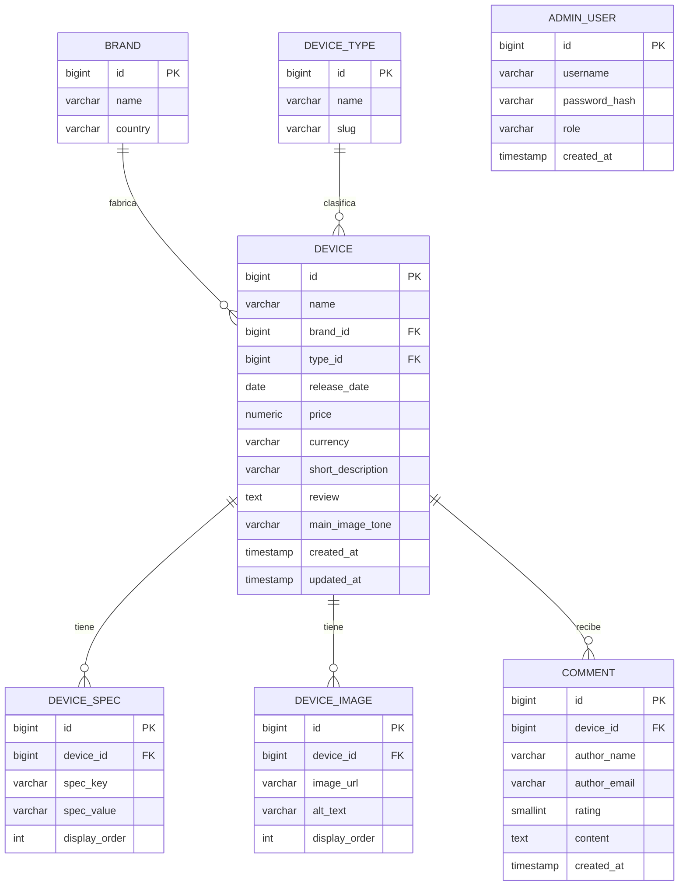

# Modelo entidad-relación — SpecHub

Este es el diseño de base de datos pensado para el backend (Java + Spring Boot,
ver `ARQUITECTURA-BACKEND.md`). El front-end actual simula estas mismas
entidades en memoria (`frontend/src/data/*` y `DataContext.jsx`) para poder
trabajar sin depender todavía del servicio.

## Diagrama (notación Mermaid)

`ADMIN_USER` no tiene relaciones directas con las demás tablas: es consumida
únicamente por el módulo de autenticación/autorización del panel de
administración (ver sección de seguridad en `ARQUITECTURA-BACKEND.md`).

## Diccionario de datos

### BRAND (marca)
| Campo | Tipo | Restricciones |
|---|---|---|
| id | BIGINT | PK, autoincremental |
| name | VARCHAR(80) | NOT NULL, UNIQUE |
| country | VARCHAR(60) | NULL |

### DEVICE_TYPE (tipo de dispositivo)
| Campo | Tipo | Restricciones |
|---|---|---|
| id | BIGINT | PK, autoincremental |
| name | VARCHAR(60) | NOT NULL, UNIQUE — ej. "Celular", "Portátil" |
| slug | VARCHAR(60) | NOT NULL, UNIQUE — ej. "celular" |

### DEVICE (dispositivo)
| Campo | Tipo | Restricciones |
|---|---|---|
| id | BIGINT | PK, autoincremental |
| name | VARCHAR(120) | NOT NULL |
| brand_id | BIGINT | FK → BRAND(id), NOT NULL |
| type_id | BIGINT | FK → DEVICE_TYPE(id), NOT NULL |
| release_date | DATE | NOT NULL |
| price | NUMERIC(12,2) | NOT NULL, >= 0 |
| currency | VARCHAR(3) | NOT NULL, default 'COP' |
| short_description | VARCHAR(200) | NULL |
| review | TEXT | NULL — reseña/sinopsis editorial |
| main_image_tone | VARCHAR(40) | NULL |
| created_at / updated_at | TIMESTAMP | NOT NULL |

### DEVICE_SPEC (ficha técnica, clave/valor)
| Campo | Tipo | Restricciones |
|---|---|---|
| id | BIGINT | PK |
| device_id | BIGINT | FK → DEVICE(id) ON DELETE CASCADE |
| spec_key | VARCHAR(80) | NOT NULL — ej. "Procesador" |
| spec_value | VARCHAR(200) | NOT NULL — ej. "Snapdragon 8 Gen 3" |
| display_order | INT | NOT NULL, default 0 |

Se modela como tabla clave/valor (en vez de columnas fijas) porque un celular,
un portátil y un smartwatch tienen atributos técnicos distintos.

### DEVICE_IMAGE (galería)
| Campo | Tipo | Restricciones |
|---|---|---|
| id | BIGINT | PK |
| device_id | BIGINT | FK → DEVICE(id) ON DELETE CASCADE |
| image_url | VARCHAR(300) | NOT NULL |
| alt_text | VARCHAR(150) | NULL |
| display_order | INT | NOT NULL, default 0 |

### COMMENT (comentario/reseña de usuario)
| Campo | Tipo | Restricciones |
|---|---|---|
| id | BIGINT | PK |
| device_id | BIGINT | FK → DEVICE(id) ON DELETE CASCADE |
| author_name | VARCHAR(100) | NOT NULL |
| author_email | VARCHAR(150) | NULL |
| rating | SMALLINT | NOT NULL, CHECK (1 ≤ rating ≤ 5) |
| content | TEXT | NOT NULL |
| created_at | TIMESTAMP | NOT NULL, default now() |

### ADMIN_USER (usuario del panel de administración)
| Campo | Tipo | Restricciones |
|---|---|---|
| id | BIGINT | PK |
| username | VARCHAR(60) | NOT NULL, UNIQUE |
| password_hash | VARCHAR(255) | NOT NULL |
| role | VARCHAR(20) | NOT NULL, default 'ADMIN' |
| created_at | TIMESTAMP | NOT NULL |

## Script SQL de referencia

Ver `docs/schema.sql` con la definición completa en DDL estándar
(compatible con PostgreSQL/MySQL), incluyendo llaves foráneas e índices.
