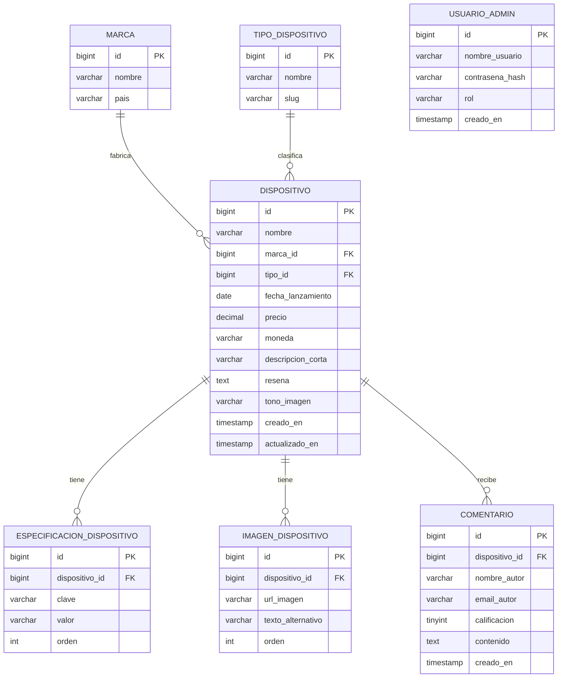

# Modelo entidad-relación — SpecHub

Este es el diseño de base de datos pensado para el backend (Java + Spring
Boot, ver `ARQUITECTURA-BACKEND.md`), sobre **MySQL**, con nombres de tablas
y columnas en **español**. El front-end actual simula estas mismas entidades
en memoria (`frontend/src/data/*` y `DataContext.jsx`) para poder trabajar
sin depender todavía del servicio; los DTOs de la API (`dto/*`) sí exponen
los campos en el mismo formato (camelCase en inglés) que ya consume el
front, para no tener que tocar los componentes de React.

## Diagrama (notación Mermaid)

`USUARIO_ADMIN` no tiene relaciones directas con las demás tablas: es
consumida únicamente por el módulo de autenticación/autorización del panel
de administración (ver sección de seguridad en `ARQUITECTURA-BACKEND.md`).

## Diccionario de datos

### MARCA
| Campo | Tipo | Restricciones |
|---|---|---|
| id | BIGINT | PK, autoincremental |
| nombre | VARCHAR(80) | NOT NULL, UNIQUE |
| pais | VARCHAR(60) | NULL |

### TIPO_DISPOSITIVO
| Campo | Tipo | Restricciones |
|---|---|---|
| id | BIGINT | PK, autoincremental |
| nombre | VARCHAR(60) | NOT NULL, UNIQUE — ej. "Celular", "Portátil" |
| slug | VARCHAR(60) | NOT NULL, UNIQUE — ej. "celular" |

### DISPOSITIVO
| Campo | Tipo | Restricciones |
|---|---|---|
| id | BIGINT | PK, autoincremental |
| nombre | VARCHAR(120) | NOT NULL |
| marca_id | BIGINT | FK → MARCA(id), NOT NULL |
| tipo_id | BIGINT | FK → TIPO_DISPOSITIVO(id), NOT NULL |
| fecha_lanzamiento | DATE | NOT NULL |
| precio | DECIMAL(12,2) | NOT NULL, >= 0 |
| moneda | VARCHAR(3) | NOT NULL, default 'COP' |
| descripcion_corta | VARCHAR(200) | NULL |
| resena | TEXT | NULL — reseña/sinopsis editorial |
| tono_imagen | VARCHAR(40) | NULL |
| creado_en / actualizado_en | TIMESTAMP | NOT NULL |

### ESPECIFICACION_DISPOSITIVO (ficha técnica, clave/valor)
| Campo | Tipo | Restricciones |
|---|---|---|
| id | BIGINT | PK |
| dispositivo_id | BIGINT | FK → DISPOSITIVO(id) ON DELETE CASCADE |
| clave | VARCHAR(80) | NOT NULL — ej. "Procesador" |
| valor | VARCHAR(200) | NOT NULL — ej. "Snapdragon 8 Gen 3" |
| orden | INT | NOT NULL, default 0 |

Se modela como tabla clave/valor (en vez de columnas fijas) porque un
celular, un portátil y un smartwatch tienen atributos técnicos distintos.

### IMAGEN_DISPOSITIVO (galería)
| Campo | Tipo | Restricciones |
|---|---|---|
| id | BIGINT | PK |
| dispositivo_id | BIGINT | FK → DISPOSITIVO(id) ON DELETE CASCADE |
| url_imagen | VARCHAR(300) | NOT NULL |
| texto_alternativo | VARCHAR(150) | NULL |
| orden | INT | NOT NULL, default 0 |

### COMENTARIO (comentario/reseña de usuario)
| Campo | Tipo | Restricciones |
|---|---|---|
| id | BIGINT | PK |
| dispositivo_id | BIGINT | FK → DISPOSITIVO(id) ON DELETE CASCADE |
| nombre_autor | VARCHAR(100) | NOT NULL |
| email_autor | VARCHAR(150) | NULL |
| calificacion | TINYINT | NOT NULL, CHECK (1 ≤ calificacion ≤ 5) |
| contenido | TEXT | NOT NULL |
| creado_en | TIMESTAMP | NOT NULL, default now() |

### USUARIO_ADMIN (usuario del panel de administración)
| Campo | Tipo | Restricciones |
|---|---|---|
| id | BIGINT | PK |
| nombre_usuario | VARCHAR(60) | NOT NULL, UNIQUE |
| contrasena_hash | VARCHAR(255) | NOT NULL |
| rol | VARCHAR(20) | NOT NULL, default 'ADMIN' |
| creado_en | TIMESTAMP | NOT NULL |

## Entidades JPA correspondientes

| Tabla (MySQL) | Entidad Java (`com.spechub.api.model`) |
|---|---|
| marca | `Marca` |
| tipo_dispositivo | `TipoDispositivo` |
| dispositivo | `Dispositivo` |
| especificacion_dispositivo | `EspecificacionDispositivo` |
| imagen_dispositivo | `ImagenDispositivo` |
| comentario | `Comentario` |
| usuario_admin | `UsuarioAdmin` |

Los campos Java usan camelCase en español (`fechaLanzamiento`, `precio`,
`descripcionCorta`...), salvo en `UsuarioAdmin`, donde `username` y
`passwordHash` se mantienen así porque ya los consume
`UsuarioAdminDetailsService` (Spring Security trabaja con esos nombres).

## Script SQL de referencia

Ver `docs/schema.sql` con la definición completa en DDL de MySQL 8+,
incluyendo llaves foráneas, índices y datos base de ejemplo (tipos de
dispositivo y marcas).
